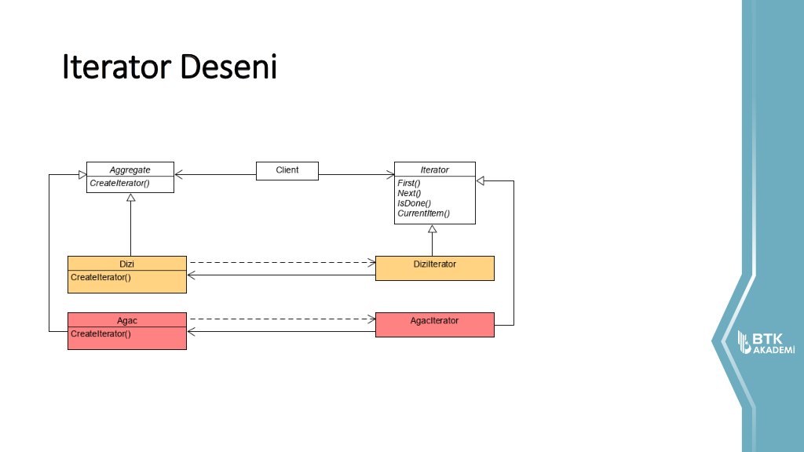
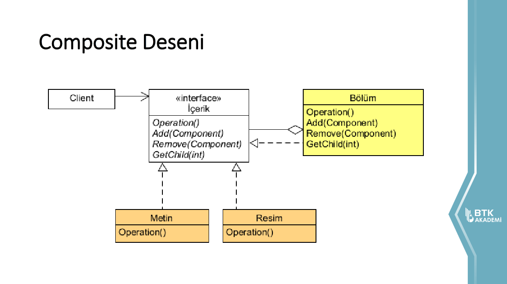
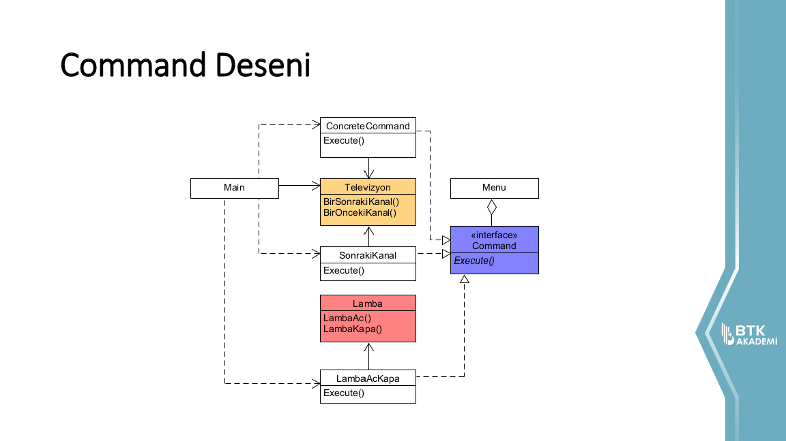
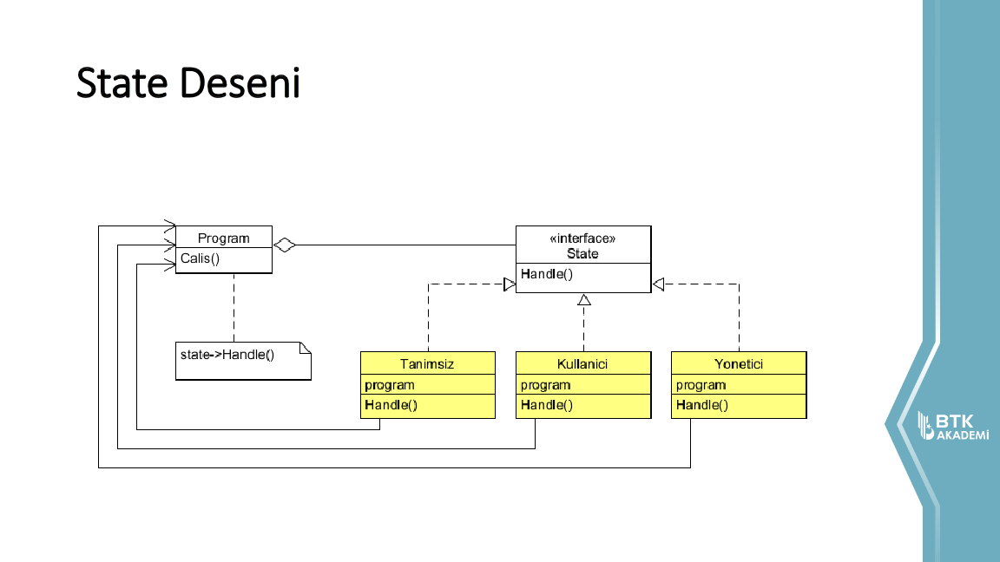
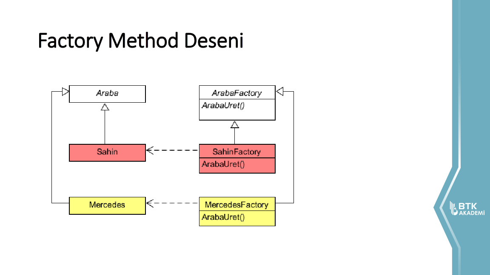
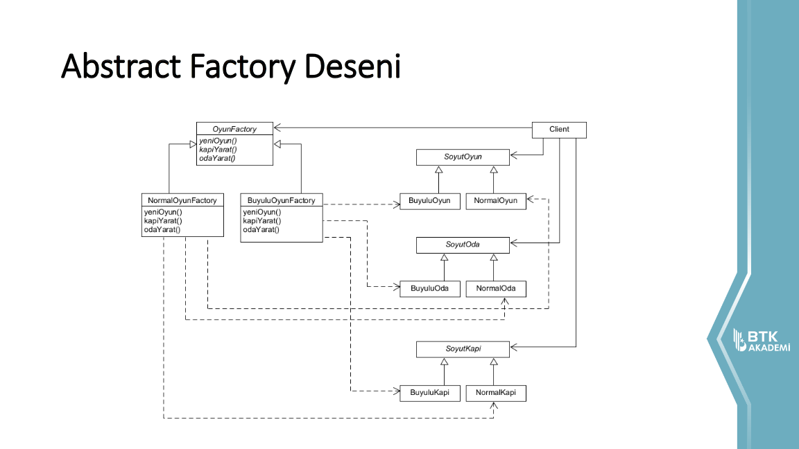
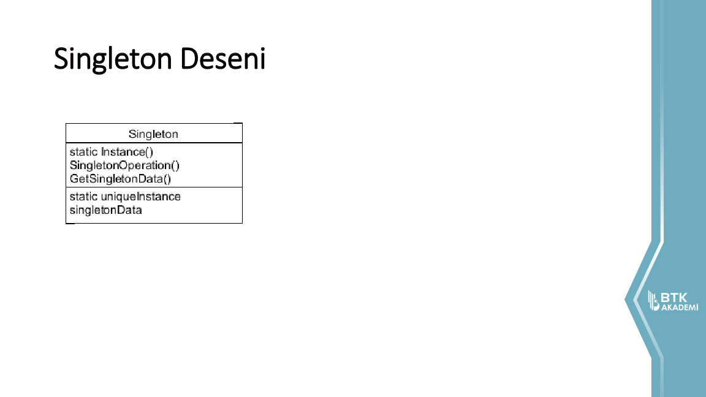
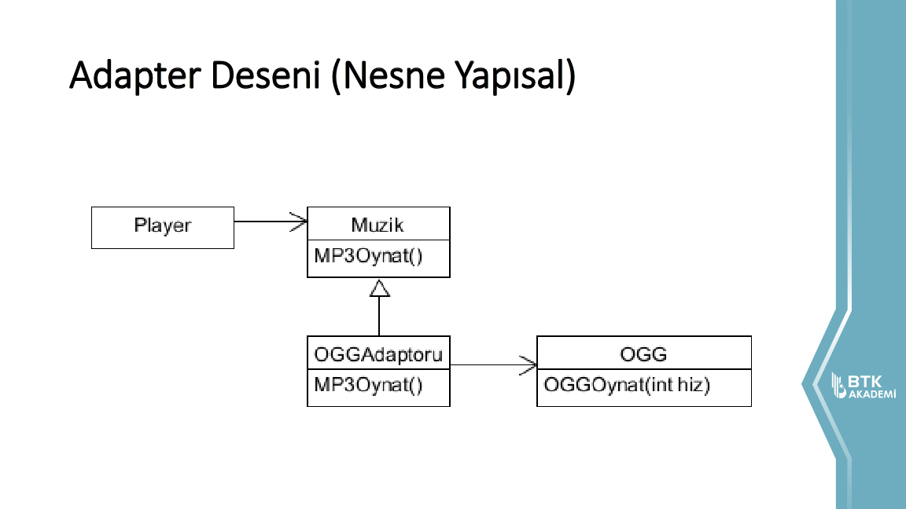
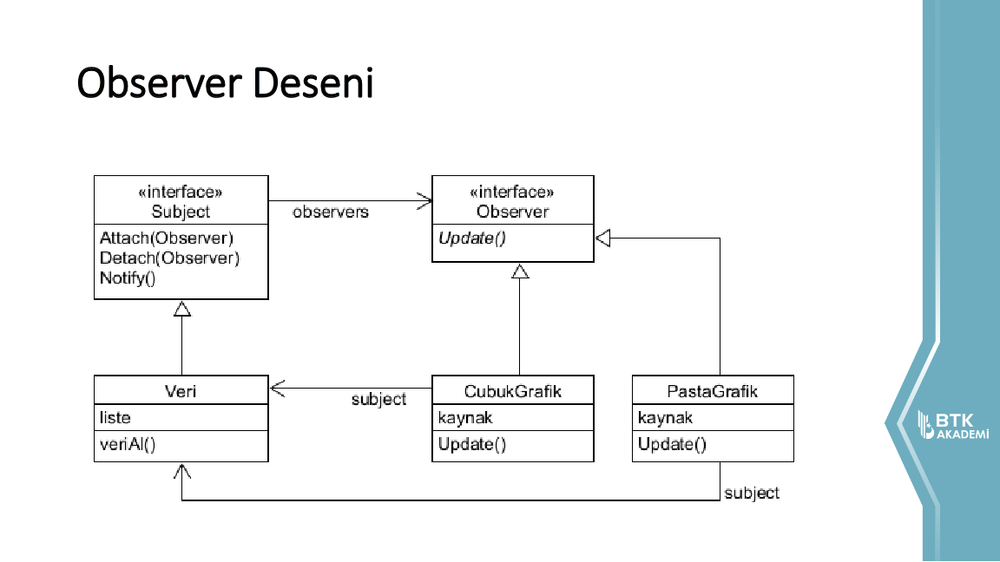
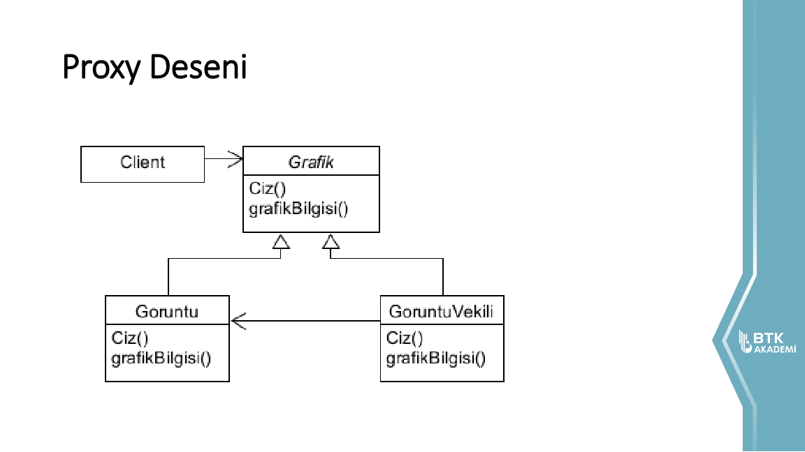

:star: BTK Akademi'de **Kaya Oğuz** tarafından verilen **Yazılım Tasarım Desenleri** eğitimine ait örnekler.

:computer: Eğitime [buradan](https://www.btkakademi.gov.tr/portal/course/yazilim-tasarim-desenleri-12150) ulaşabilirsiniz.

## Tavsiye Edilen Kaynaklar
- `Design Patterns: Elements of Reusable Object-Oriented Software`
~Gamma Erich, Helm Richard, Johnson Ralph, Vlissides John

- `Head First Design Patterns: A Brain-Friendly Guide`
~Eric Freeman, Elisabeth Robson, Bert Bates, Kathy Sierra

## Örneklerin UML Diyagramları

### [00) Iterator Design Pattern](patterns-00-iterator)

### [01) Composite Design Pattern](patterns-01-composite)

### [02) Command Design Pattern](patterns-02-command)

### [03) State Design Pattern](patterns-03-state)

### [04) Factory Method Design Pattern](patterns-04-factory_method)

### [05) Abstract Factory Design Pattern](patterns-05-abstract_factory)

### [06) Singleton Design Pattern](patterns-06-singleton)

### [07) Adapter Design Pattern](patterns-07-adapter)

### [08) Observer Design Pattern](patterns-08-observer)

### [09) Proxy Design Pattern](patterns-09-proxy)

